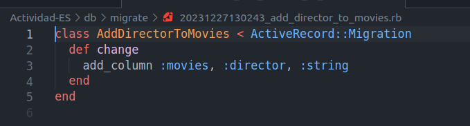
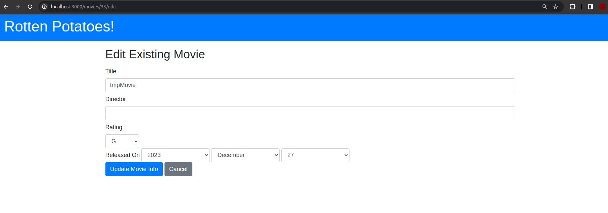

# Parte 1: El ciclo de prueba de aceptación-prueba unitaria

Empezaremos nuestra tarea con escenario Cucumber que fallan, y, paso a paso, escribiremos el código para que dichos pasos puedan pasar las pruebas. De manera general, agregaremos la característica "buscar películas con el mismo director" a rottenpotatoes. 

## Corre y prepara rottenpotatoes

Cambiamos al directorio de rottenpotatoes que se ha entregado para esta actividad. E inmediatamente ejecutaremos `bundle install --without production` para asegurar que las gemas y dependencias necesarias estén instaladas.

Como se puede apreciar, no ha habido algún inconveniente respecto a versiones de Ruby o similares, por lo que se puede continuar con el trabajo sin problema alguno.

Seguidamente, crearemos el esquema de base de datos inicial. Dado nuestro proyecto, este será implementado en `db/migrate/20111119180638_create_movies.rb`, y tendrá la siguiente estructura:

Luego, aunque de manera opcional, agregaremos algunos datos adicionales a nuestro archivo `db/seeds.rb`. Para nuestro caso, he agregado la película `tmpMovie`.

A continuación, realizaremos la migración y la llenaremos con los datos proporcionados en `seeds.rb`.

Inmediatamente, tendremos los siguientes archivos creados:

Verficamos el funcionamiento de RSpec ejecutando `rspec`:

Y verificamos la configuración de cucumber ejecutando `cucumber`:

Asimismo se muestra el caso de error mencionado.

## Agregar un campo Director a Movies

Crearemos y aplicaremos una migración que agregue el campo director a la tabla de películas, tal que este sea una cadena que contenga el nombre del director. Realizaremos ello por medio de `add_column` de `ActiveRecord::Migration`. Primero, generaremos la migración con el comando `rails g migration AddDirectorToMovies director:string`, en donde podemos notar que al elegir dicho nombre para la migración, se nos generará el siguiente archivo:

De este última migración que se ha generado podemos ver el uso de `add_column` hacia `:movies`, y el campo a agregar sera `:director` de tipo `:string`.

Realizamos la migración respectiva. Además podremos notar que en nuestro archivo `db/schema.rb` se verá incluido dicho nuevo campo para director `t.string "director"`.

Luego, preparamos para cargar el nuevo esquema posterior a la migración en la base de datos de prueba por medio de `bundle exec rake db:test:prepare`.

Vemos que al ejecutar nuestra app, esta ser verá de la siguiente manera.

Sin embargo, necesitamos modificar nuestras vistas y nuestro modelo para que se pueda apreciar el nuevo campo para los directores. Para ello, empezaremos modificando nuestra vista `index`, y en ella agregaremos el nuevo campo para director.

Cuando volvamos a ejecutar nuestra aplicación, se podrá apreciar que ahora tenemos una columna en blanco para los directores.

Sin embargo, esta no es la única vista que se ha de modificar, queda pendiente modificar la vista `new`, `edit` y `show`. Estas quedarán de la siguiente manera, respectivamente.

Podremos apreciar estos cambiar al correr nuevamente nuestra aplicación. Se muestran los cambios en el orden respectivo de las modificaciones.

Luego, nuestro modelo agregaremos la siguiente línea:
Respecto a nuestro modelo, para lograr que este nuevo campo "se note", haremos uso de `attr_accessor` para este nuevo campo; de manera adicional se ha agregado para los campos faltantes.

Ejecutando ahora cucumber, vemos como algunos escenarios pasan:

Estos escenarios son aprobados porque ya se encuentra implementado director en nuestra base de datos, y dichos escenarios muestran que si me dirijo a movies, voy a ser capaz de encontrar a los directores correspondientes.

Vemos que los pasas background ahora pasan, pero el primer paso de cada escenario falla porque no hemos proporcionado the edit page.

Dado la prueba de cucumber, vemos que tenemos que dirigirnos a features/support/paths.rb, que es de donde se está generando el error. Agregaremos los siguientes mapeos de edit y details que son dados por las pruebas de cucumber:

Luego, respecto a las modificaciones que se tendrán que realizar en el controlador tenemos el siguiente método al cual agregaremos el campo de director:

De no realizar este cambio, las acciones de create y update no funcinarían correctamente dado que se debería de manejar el campo director.

    ## Utiliza pruebas de aceptación para aprobar nuevos escenarios

Para el primer escenario tenemos:

Realizamos la siguiente moficación:

Ahora tendremos:

Para solucionar los siguiente errores, nos dirigiremos a nuestra vista edit, en donde tendremos que agregar los campos de director:

## Cobertura de código

Para este apartado de utilzará SimpleCov para la medición de cobertura de pruebas, para nuestro caso, volveremos a ejecutar las pruebas de cucumnber, y SimpleCov nos dará un informe en coverage/.

Cuyo informe obtenido será:

Podemos notar que aún será necesario realizar pruebas específicamente en el archivo movies_controller.rb.
