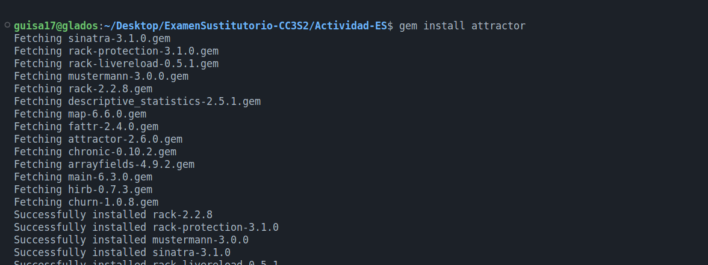

# Parte 2

## Pregunta 1

**¿Por qué la abstracción de un objeto de formulario pertenece a la capa de presentación y no a la capa
de servicios (o inferior)?**

La abstracción de un objeto de formulario pertenece a la capa de presentación en lugar de la capa de servicios debido a que los formularios son puntos clave de la interfaz de usuario y se encuentran directamente relacionados con la presentación de datos. Mientras que la capa de presentación se encarga de la interacción con el usuario, este mostrará información la información y manejará la lógica de validación y formato de datos en estos formularios; por otro lado, la capa de servicios (o inferior) se centra en la lógica empresarial y la manipulación de datos en las bases de datos, sin conexión directa con los formularios.


## Pregunta 2

**¿Cuál es la diferencia entre autenticación y autorización?**

La autenticación es el proceso de verificar la identidad de un usuario, es el poder verificar de un usuario quien dice ser, mientras que la autorización se encarga de gestioanar permisos o accesos a usuarios, una vez se haya realizado la respectiva confirmación de identidad (autorizado), es manejar los permisos que se le pueden dar a un usuario una vez ha sido identificado.


## Pregunta 3

Del texto proporcionado tenemos:

**¿Qué pasa si omite el middleware de Rack y se pasa la solicitud al enrutador directamente
(Rails.application.routes.call(request))?**

Si se omite el middleware de Rack y se pasa la solicitud directamente al enrutador (utilizando Rails.application.routes.call(request)), evitaremos la ejecución de los middlewares en la cadena. Como resultado, los middlewares responsables de tareas como autenticación o registro no se activarán.

**¿Qué pasa si se omitie el enrutador y llamar a una acción del controlador de inmediato (por ejemplo, PostsController.action(:index).call(request))?**

Al omitir el enrutador y llamar inmediatamente a una acción del controlaro, se omite el proceso de enrutamiento estándar. Esto significa que la solicitud no sigue la ruta habitual a través del enrutador para determinar la acción del controlador según la URL y los parámetros. En su lugar, accderemos directamente a la acción del controlador especificado, pero perdermos las funcionalidades del enrutador, como la generación de rutas y el manejo de parámetros.

---

La gema trace_location (https://github.com/yhirano55/trace_location) es el pequeño ayudante de un
desarrollador curioso. Su objetivo principal es aprender qué sucede detrás de escena de las API simples
proporcionadas por librerías y frameworks. Te sorprenderá lo complejos que pueden ser los aspectos
internos de las cosas que das por sentado (por ejemplo, user.save en Active Record).

Diseñar API simples que resuelvan problemas complejos es un verdadero dominio del desarrollo de
software. En el fondo, esta joya utiliza la API TracePoint de Ruby (https://rubyapi.org/3.2/o/tracepoint),
una poderosa herramienta de introspección en tiempo de ejecución.


**Utiliza trace_location para realizar algunos experimentos y analizar los resultados.**

Primero realizaremos la instalación respectiva por medio de `gem install trace_location`.


Seguidamente, haciendo uso de nuetra aplicación rottenpotatoes, incluiremos `TraceLocation.trace` para poder rastrear la ejecución de ciertas llamdas de ActiveRecord, y así entender el flujo de ejecución y solución de problemas más específicos. Por ejemplo, podremos usar los ejemplos dados en la documentación.


Para seguir la validación del proceso ActiveRecord, obtendremos lo siguiente resultados:


## Pregunta 4

Preparamos one-liner (https://linuxcommandlibrary.com/basic/oneliners) de Unix para mostrar los N primeros archivos complejos de Ruby usando Flog. Para un N = 10:

```
find app/models -name "*.rb" | while read file; do echo -n "$file "; git log --format=oneline -- "$file" | wc -l; done | sort -k 2 -nr | head -n 10 | while read file commits; do echo -n "$file "; flog -s "$file"; done
```


Lo que esto hará será un análisis combinado de la cantidad de commits y la complejidad del código para los archivos Ruby en el directorio `app/models`. Para nuestro caso, se busca proporcionar a lo más 10 archivos con la mayor cantidad de commits junto con su complejidad calculada meidante `flog`. Para realizar esto último, instalaremos la gema respectiva.


Seguidamente, se puede mostrar la gráfica entre Churn y Complexity generado a través de la gema attractor (https://github.com/julianrubisch/attractor).



