# Parte 3

## Pregunta 1

**Crea varias funciones que te permitirán interactuar con las cookies de la página, incluida la lectura de un valor de cookie por nombre, la creación de una nueva cookie usando un nombre y su configuración para una cantidad determinada de días, y la eliminación de una cookie.**

Configuraremos este en un archivo html temporal:
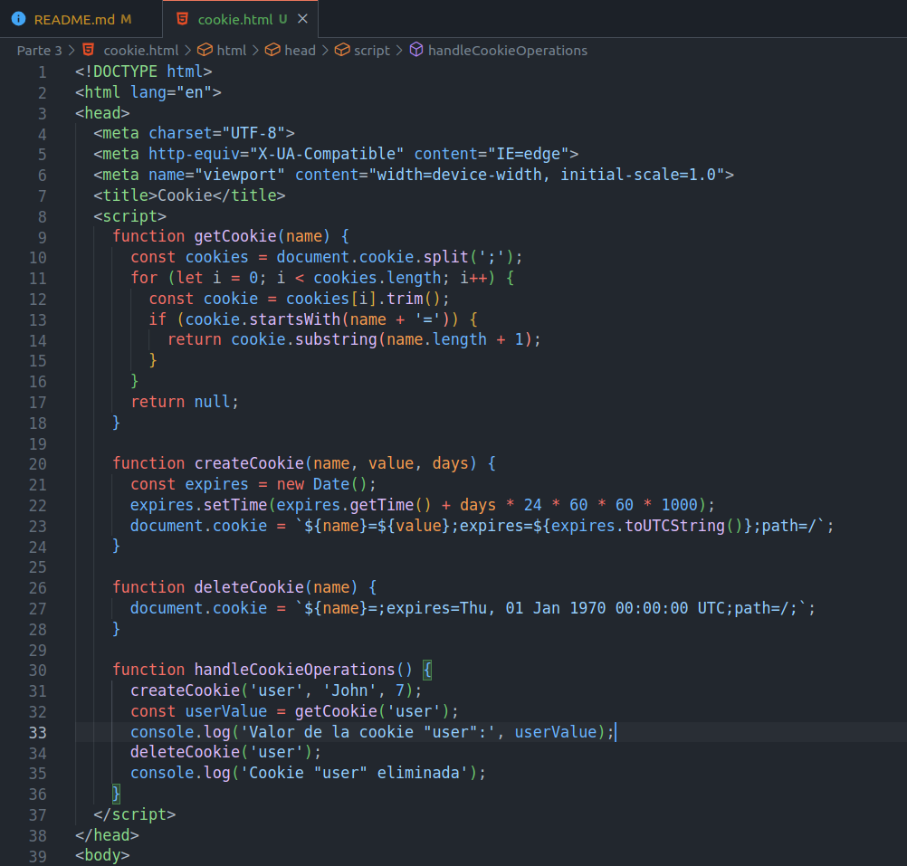

Haremos uso del código proporcionado mediante el botón que hemos implementado, abriremos nuestro archivo `cookie.html` en el navegador y abriremos la consola. Podemos apreciar como al dar el botón, las operaciones funcionan tal como se ha espearado.

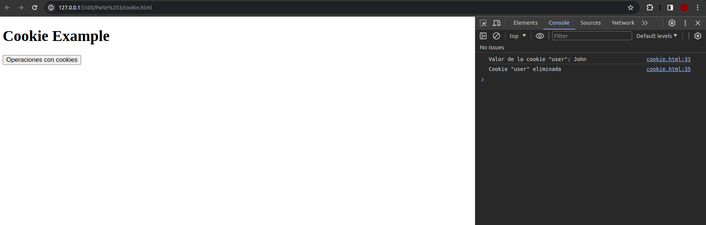

## Pregunta 2

**Este ejercicio es un ejemplo de una estructura de formulario típica en la que se verifican los valores ingresados en el formulario y se validan antes de enviar el contenido. Se devuelve una respuesta alusuario si los valores no cumplen con los criterios de validación en el código. Utiliza el siguiente HTML y CSS como plantilla inicial:**

Sea nuestro archivod dado:

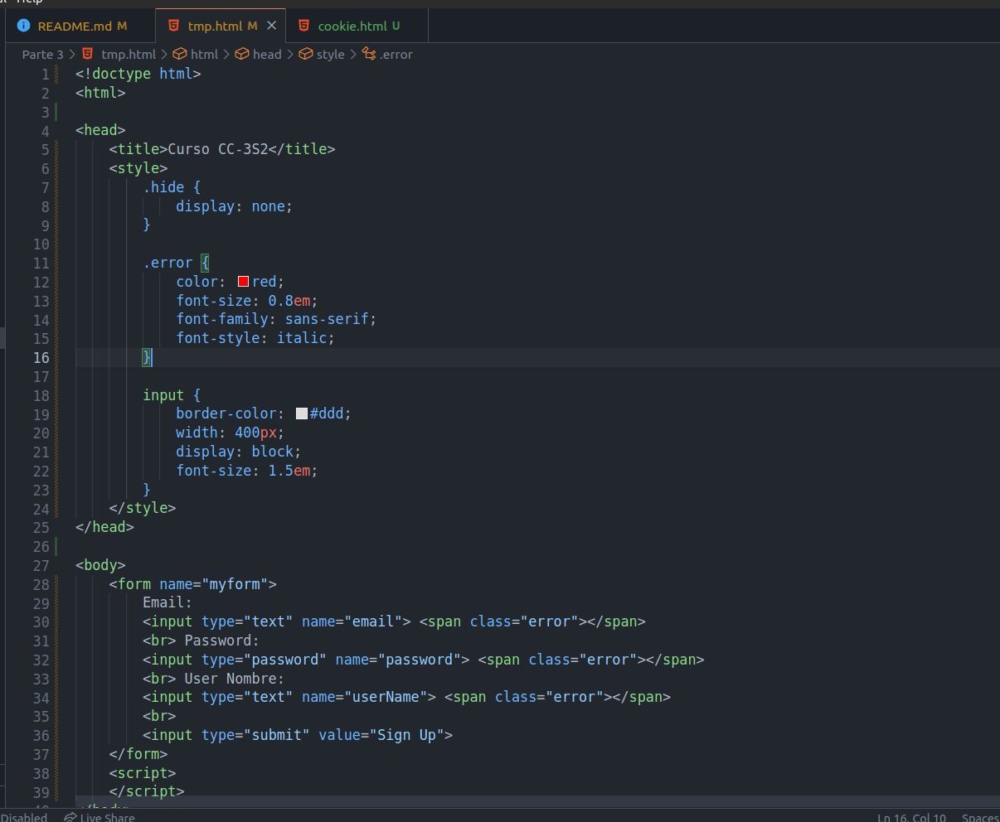
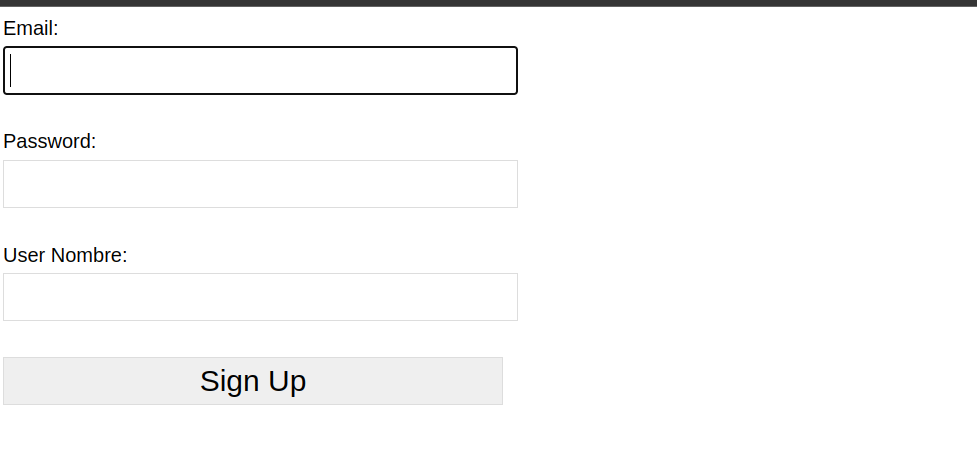

Crearemos nuestro archivo `script.js` en donde iremos implementando lo siguiente:

1. Usando JavaScript, selecciona todos los elementos de la página y configúralos como objetos JavaScript para que sean más fáciles de seleccionar dentro del código. Selecciona también todos los elementos de la página que tengan la clase error como objeto.

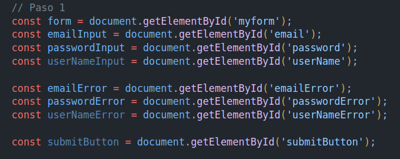

2. Agrega un detector de eventos para enviar y capturar el clic, evitando la acción del formulario predeterminado.

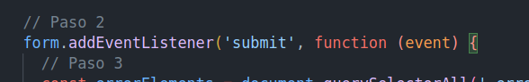

3. Recorre todos los elementos de la página que tienen la clase error y agrega la clase ocultar, lo que los eliminará de la vista ya que se trata de un envío nuevo.

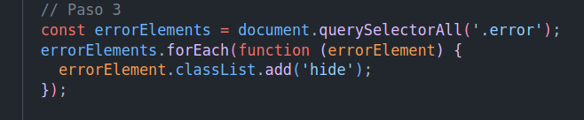

4. Utilizando la expresión regular para correos electrónicos válidos, prueba los resultados con el valor de entrada del campo de correo electrónico.

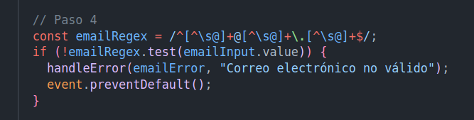

5. Crea una función para responder a errores, que elimine la clase oculta del elemento junto al elemento que desencadenó el evento.

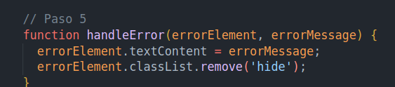

7. Verifica el valor de entrada del campo de contraseña para asegurarye de que solo se utilicen letras y números. También verifica la longitud para asegurarse de que tenga entre 3 y 8 caracteres. Si alguno de ellos es falso, agrega el error con la función error y crea un mensaje para el usuario. Establece el error booleano en verdadero.

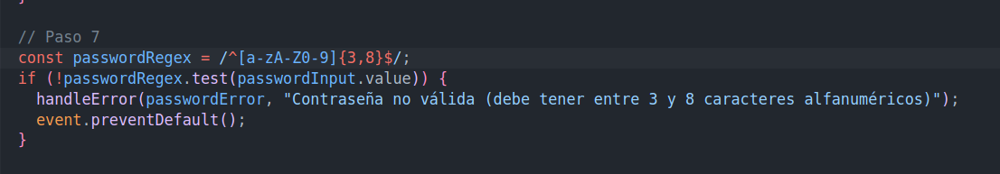

8. Agrega un objeto para realizar un seguimiento de la creación de datos del formulario y agrega valores al objeto recorriendo todas las entradas, configurando el nombre de la propiedad para que sea el mismo que el nombre de la entrada y el valor igual que el valor de la entrada.

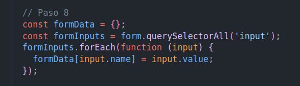

9. Antes de finalizar la función de validación, verifica si todavía hay un error y, si no es así, envía el
objeto de formulario.

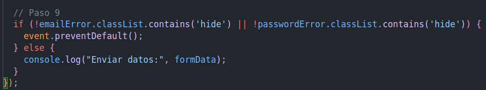

Luego de la implementación completa de script.js, pasaremos a probarlo:

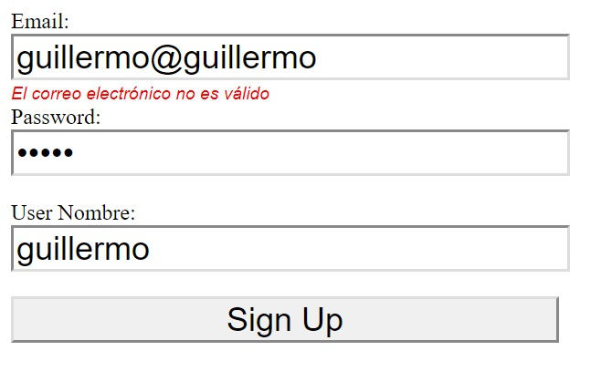

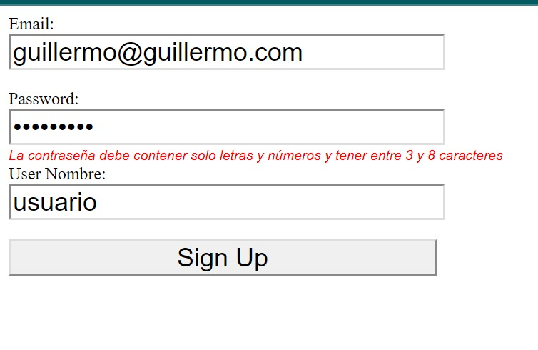

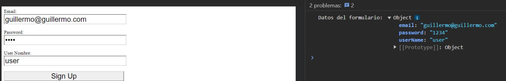

