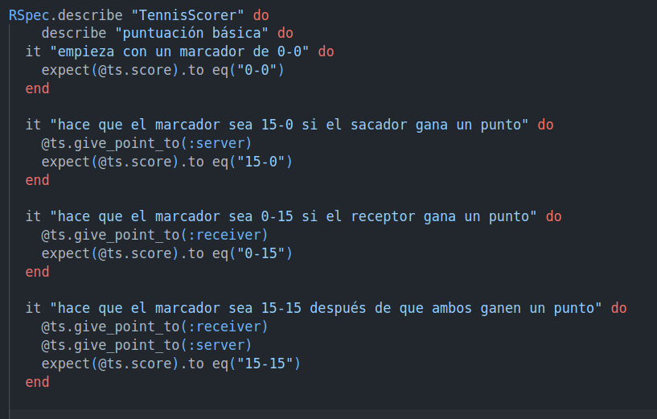
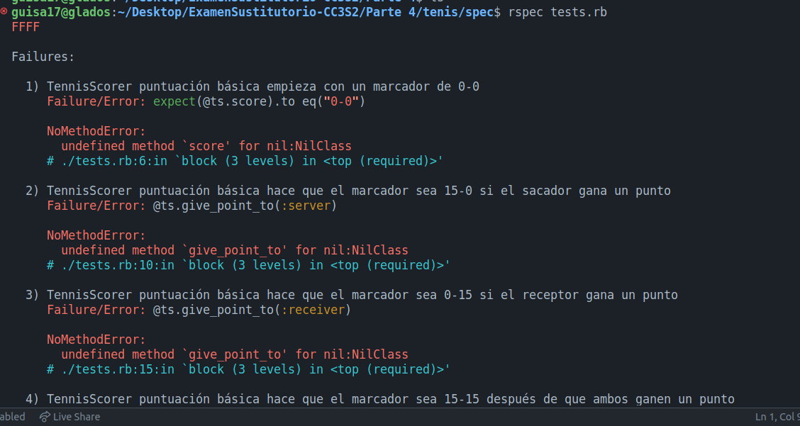
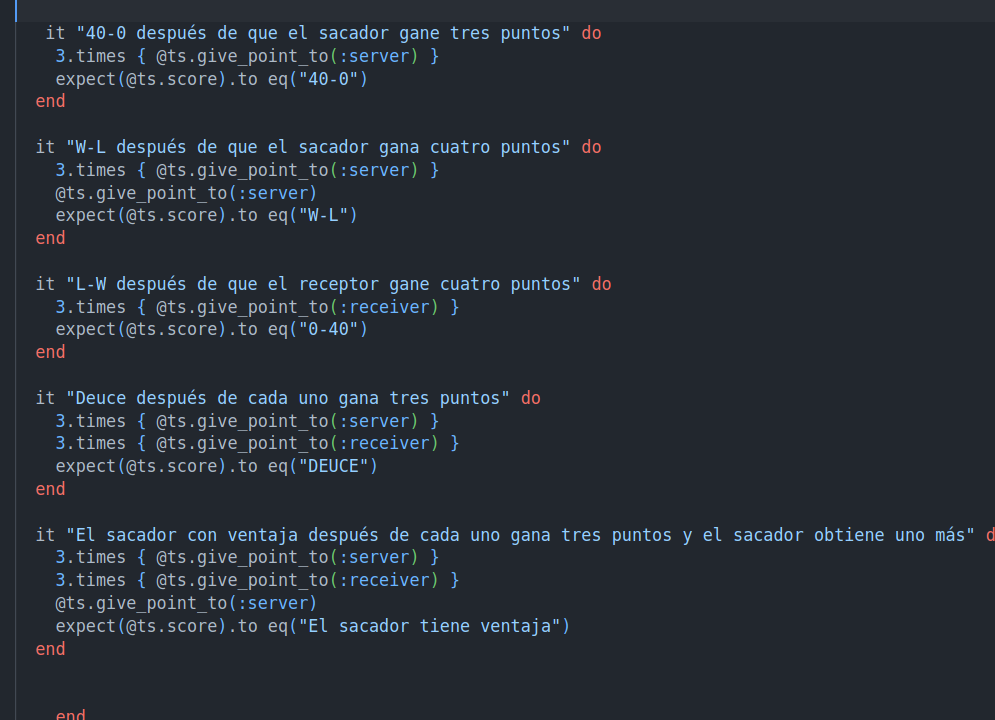
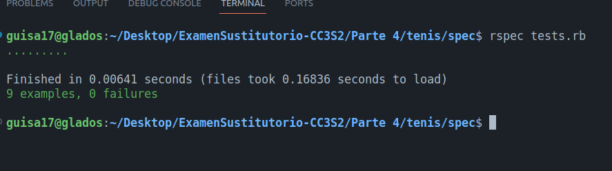

# Parte 4

Generaremos un proyecto `tenis`, y sobre él, haremos uso de la gema RSpec, para realizar las pruebas respectivas. Emepzaremos creando nuestro proyecto.

Seguidamente, haremos uso de la gema rspec (rspec-rails en nuestro Gemfile) por medio del siguiente comando:

Luego, crearemos el archivo `tests.rb` en nuestro spec. En donde implementaremos la clase TennisScorer, tal como se ha dado:

Ejecutaremos por medio de `rspec tests.rb`:

Implementaremos la siguiente clase.

Este código de la clase TennisScorer simplifica y organiza la lógica del marcador de tenis. En la inicialización, se establece el puntaje inicial para ambos jugadores. El método público calculate_score determina el estado actual del juego, considerando casos como "DEUCE" cuando ambos jugadores tienen un puntaje de 3, y traduce el puntaje a su representación en el tenis convencional. Además, gestiona las condiciones de victoria ("W-L" o "L-W") cuando un jugador alcanza una ventaja de dos puntos sobre el otro. Se emplean funciones privadas para dividir la lógica en partes más pequeñas y comprensibles, facilitando la lectura y mantenimiento del código. Este diseño mejora la legibilidad y claridad del código al tiempo que mantiene la funcionalidad esencial del sistema de puntuación del juego de tenis.

Modificando:

Respecto a las pruebas adicionales:

