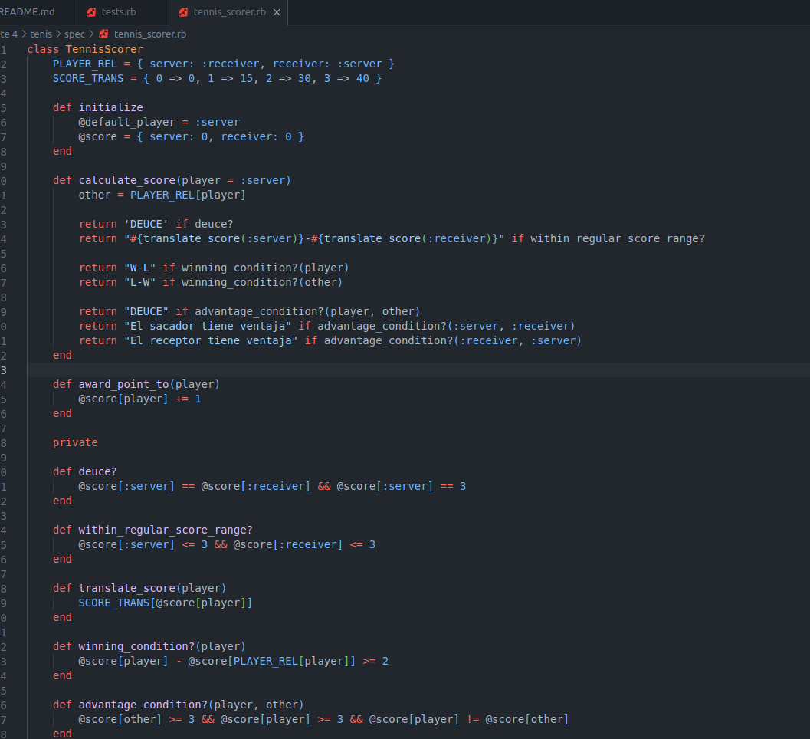

# Parte 4

Generaremos un proyecto `tenis`, y sobre él, haremos uso de la gema RSpec, para realizar las pruebas respectivas. Emepzaremos creando nuestro proyecto.

Seguidamente, haremos uso de la gema rspec (rspec-rails en nuestro Gemfile) por medio del siguiente comando:

Luego, crearemos el archivo `tests.rb` en nuestro spec. En donde implementaremos la clase TennisScorer, tal como se ha dado:

Ejecutaremos por medio de `rspec tests.rb`:

Implementaremos la siguiente clase.

