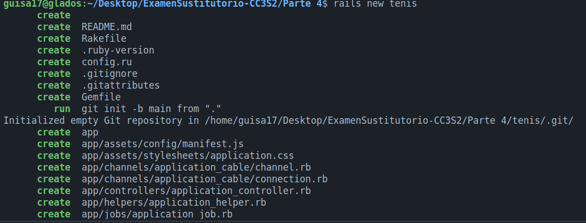
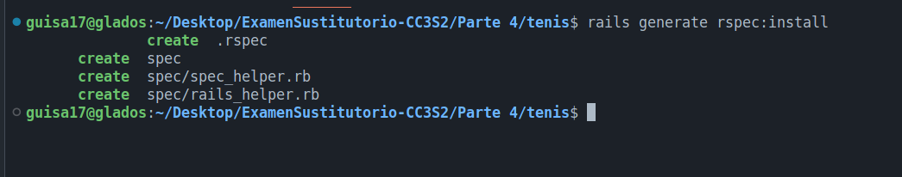
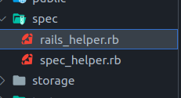
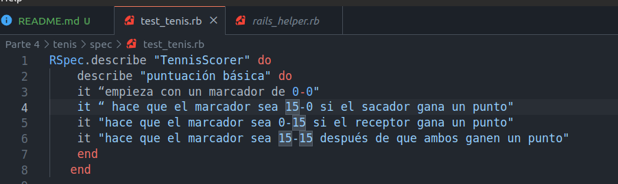
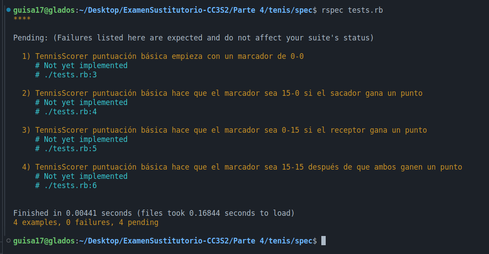

# Parte 4

Generaremos un proyecto `tenis`, y sobre él, haremos uso de la gema RSpec, para realizar las pruebas respectivas. Emepzaremos creando nuestro proyecto.

Seguidamente, haremos uso de la gema rspec (rspec-rails en nuestro Gemfile) por medio del siguiente comando:

Luego, crearemos el archivo `tests.rb` en nuestro spec. En donde implementaremos la clase TennisScorer, tal como se ha dado:

Ejecutaremos por medio de `rspec tests.rb`:

Una vez que nuestro archivo de prueba ha sido probado, procedemos a completar la implementación de nuestra clase TennisScorer para garantizar que supere todas las pruebas:

Utilizamos el hash SIGTE_PUNTO, el cual asigna los valores del puntaje actual a su representación en el juego de tenis. Por ejemplo, SIGTE_PUNTO[0] devuelve 0, SIGTE_PUNTO[1] devuelve 15, y así sucesivamente.

Asimismo, empleamos el hash OTRO_JUGADOR para mapear al jugador actual con el otro jugador. Por ejemplo, OTRO_JUGADOR[:saca] devuelve :recibe, y viceversa.

El método initialize inicializa el marcador con un puntaje de 0 para ambos jugadores.

Por otro lado, el método score calcula el puntaje del juego para un jugador determinado. Este método toma un parámetro opcional, player, que especifica el jugador para el cual se calculará el puntaje. Por defecto, se asume que el jugador es el que saca. El método realiza verificaciones condicionales para determinar el resultado del juego y devuelve una cadena que representa el puntaje resultante, según las pruebas proporcionadas. Por ejemplo, si el sacador gana un punto, el marcador se actualiza a 15-0.

Finalmente, el método punto incrementa el puntaje del jugador especificado en 1.

Al realizar las pruebas de la clase TennisScorer, confirmamos que todos los casos de prueba se ejecutan correctamente, validando así la implementación de la clase.